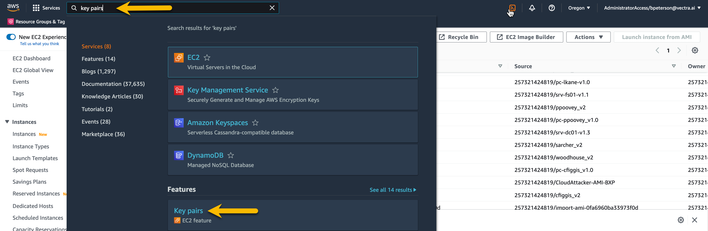
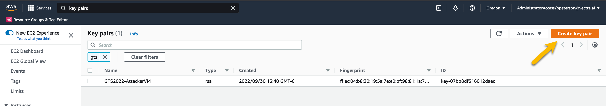
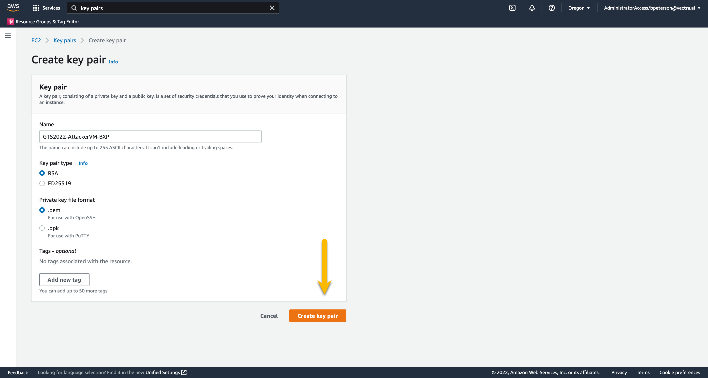
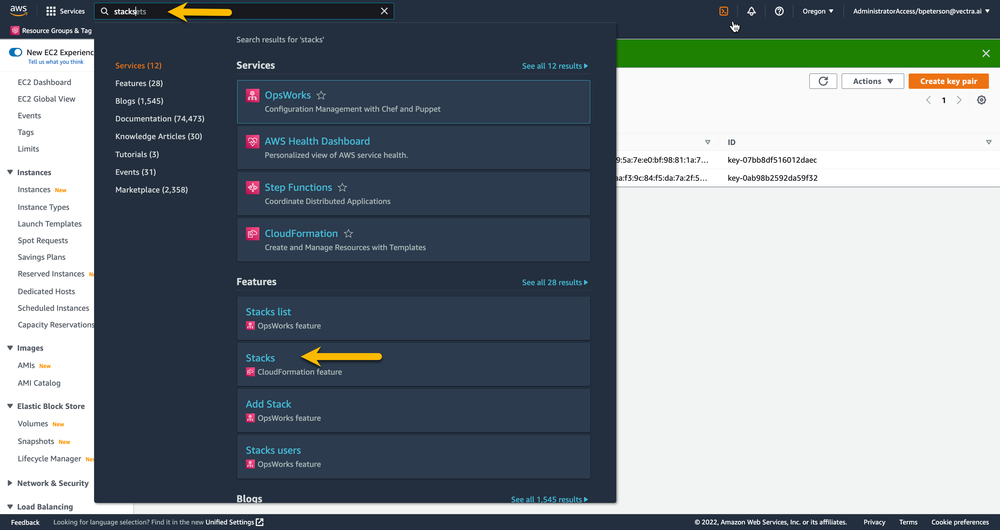
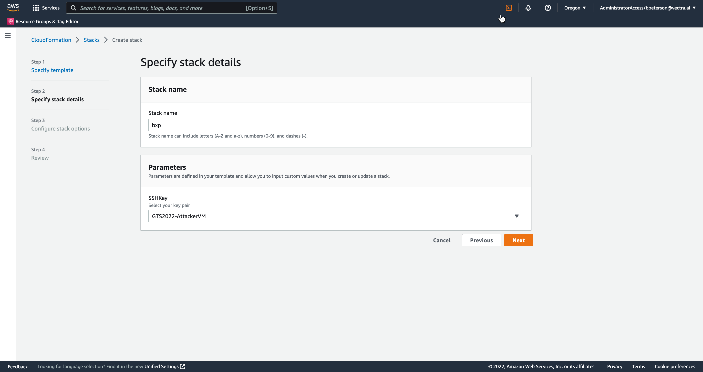
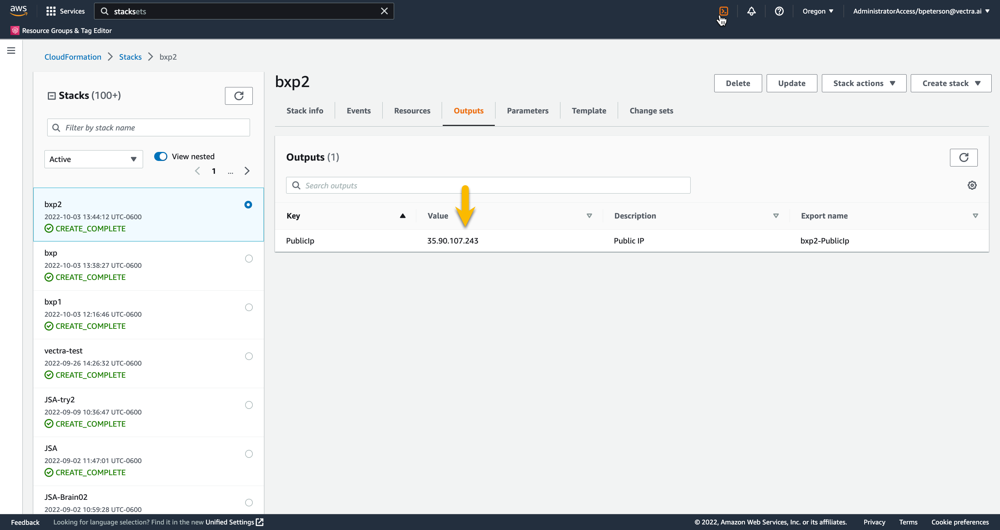

# Create Azure Cluster

## Overview
We created an AMI with the attacker tools pre installed.  This includes aws cli, terraform. cloudgoat, pacu, and their dependencies.  This AMI is available in a CloudFormation template   This AMI can be used to run any of the AWS control plane attack scenarios.  The AMI is already setup with the Vectra SSO profile for aws cli.

## Notes 
- The AMI is private and only available in the  account

##  Creating a Key Pair 
The EC2 instance created by the CloudFormation template requires a key pair.  Before launching the CFT stack a key pair should be created.  

To create a key pair search "key pairs" in the AWS 

1.  In the AWS Management Console navigate to the **Key pairs** page by typing **key pairs** in the search field and choose the key pairs EC2 feature.  Do NOT choose the AWS Key Management Service.

    

2.  On the Key pairs page press **Create key pair** on the top right

    

3.  On the Create key pairs page name your key **GTS2022-AttackerVM-INITIALS**

4.  For Key pair type choose **RSA** (default)

5.  For Private key file format choose the appropriate type for your SSH client

6.  Press **Create key pair**.  When you create the key pair a download will start of the private key.  You will need this key to SSH to your attacker VM.  Do not lose this key!  This key is not stored anywhere else!

     

##  Creating Attacker VM from CloudFormation Template
Now that we have a key pair we are ready to start the CFT stack.

1.  First download the CFT [here](remove.yaml)

2.  In the AWS Management Console navigate to the **CFT Stacks** page by typing **stacks** in the search field and choose the stacks CloudFormation feature

    

3.  On the Stacks page press **Create stack** on the top right.  In the drop down choose **with new resources (standard)**

4.  On the Create stack page under Prepare template select **Template is ready** (default).  Under template source choose **Upload a template file**.  Choose your template file you previously downloaded.

    

5.  Press **Next** and enter a stack name of your **INITIALS**.  The CFT will automatically name your EC2 instance the name of your stack

6.  Under Parameters find your SSH key **GTS2022-AttackerVM-INITIALS** in the drop down and press **Next**

    

7.  On the Configure stack options page leave everything their default values and press **Next**

8.  On the Review page scroll to the bottom and press **Create stack**

9.  Once the stack complete press the **Outputs** tab and take note of the IP address

    

