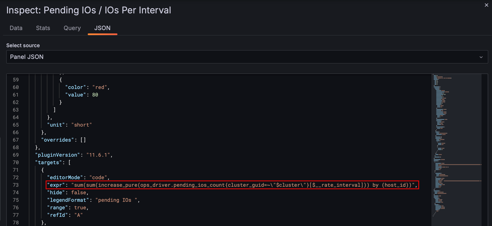
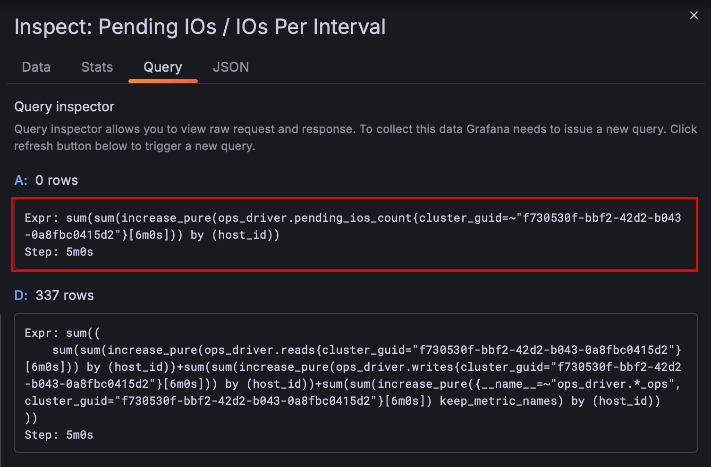

# Using Grafana to Explore WEKA Metrics

## Reviewing Preset Dashboards

- To check for a metric not covered in your existing dashboards:
  - Open **Cluster Info**, or
  - Navigate to **Dashboards → WEKA Presets**

- Example: **Availability Dashboard**
  - Select the **customer** (e.g., `N/A`)
  - Select the  **cluster** (e.g., `dev cluster`)
  - Review available metrics within the dashboard panels

## Retrieving Metric Stat Names

- On **Pending IOs / IOs Per Interval** Open a panel’s menu (three dots) on the top right
- Go to **Inspect**
- Select **Data**
- Select **JSON** tab
- The **expr** field contains the **PromQL (Prometheus Query Language)**

- This query indicates the **metric name**
- You can also use the **Query** tab to see the expression 

---

## NO EXPLORE AVAILABLE***
## Exploring Custom Metrics

### Accessing the Explore Pane

- Go to **Explore** from the Grafana sidebar
- Choose the data source — typically: `Victoria Metrics`
  - This contains all cluster metrics

### Query Methods

- Two input modes are available:
  - **GUI Builder** (assists with query construction)
  - **Code Editor** (raw PromQL)

### Example Query: `ops_driver_read_bytes`

- Apply filters using available labels:
  - Common labels: `cluster_guid`, `hostname`, `node_id`, etc.
- Filter by `cluster_guid` to narrow to a specific cluster
- The generated PromQL query is shown in the builder
- Time range defaults to "last 1 hour" but can be adjusted
- Run the query to see results

---

## Interpreting Results

- Two result formats:
  1. **Graph View** — plots time series
  2. **Raw Data** — shows labels and values per time series

- Example result:
  - Node: `261`
  - Metric: `read bytes` (unit: bytes)
  - Flat value over time indicates no reads occurred
  - Metric type: **counter**

- In this example, 17 time series are returned, indicating 17 nodes
- The graph can be toggled between line, dot, or bar view (default: line)

---

## Working with Multiple Queries

- Multiple queries can be added in the Explore pane
- Example:
  - Add a second metric query (e.g., `write bytes`)
  - Results will show multiple values (e.g., Value A, Value B)
  - Each value can be renamed for clarity
  - You can hide specific queries to focus on others

---

## Notes

- Grafana may limit displayed series (e.g., “Only showing 20 series”) if too many are returned
- This can happen when querying metrics with high cardinality