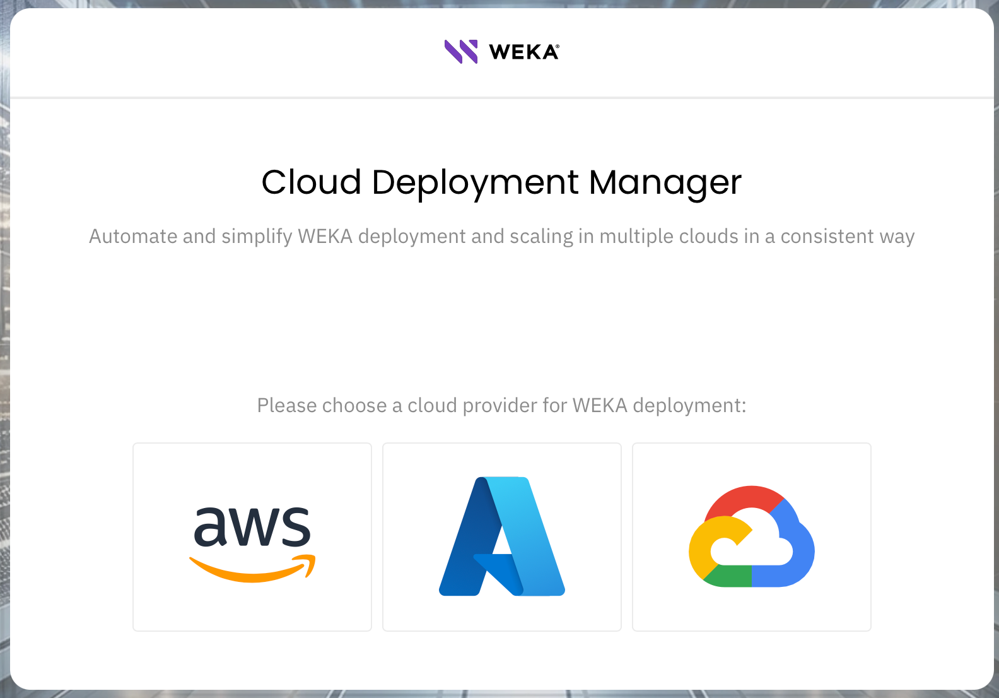
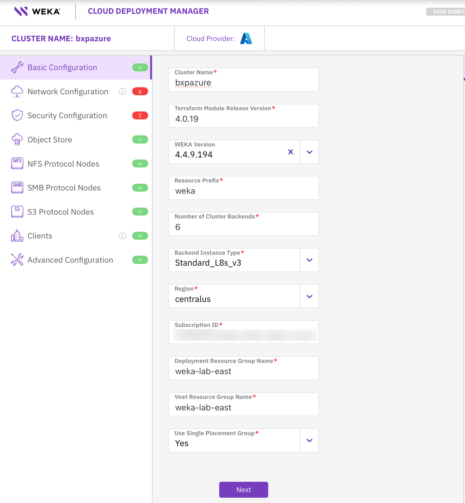
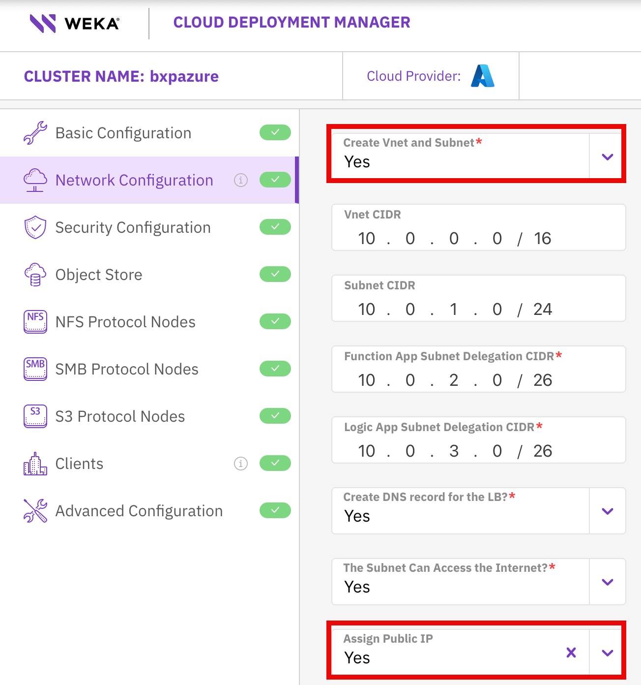
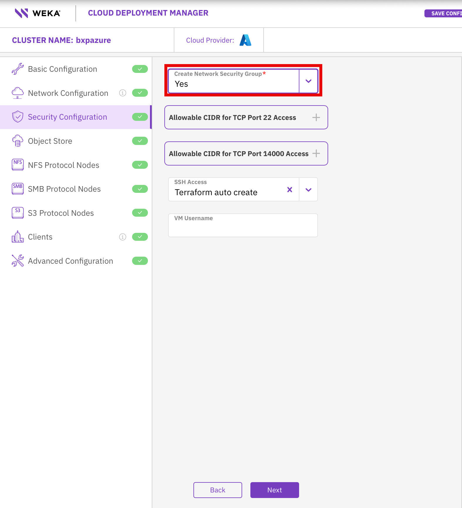
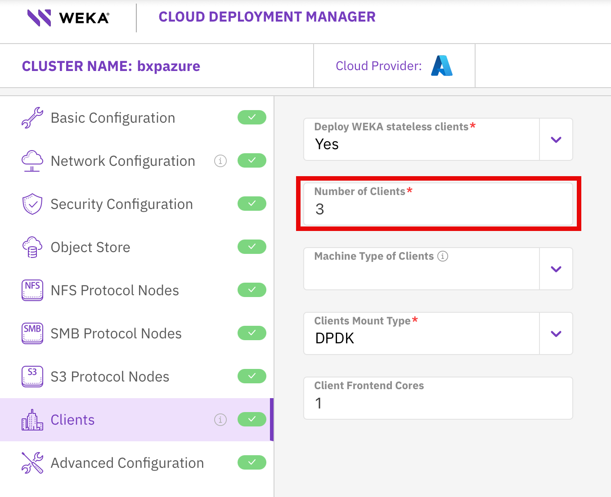
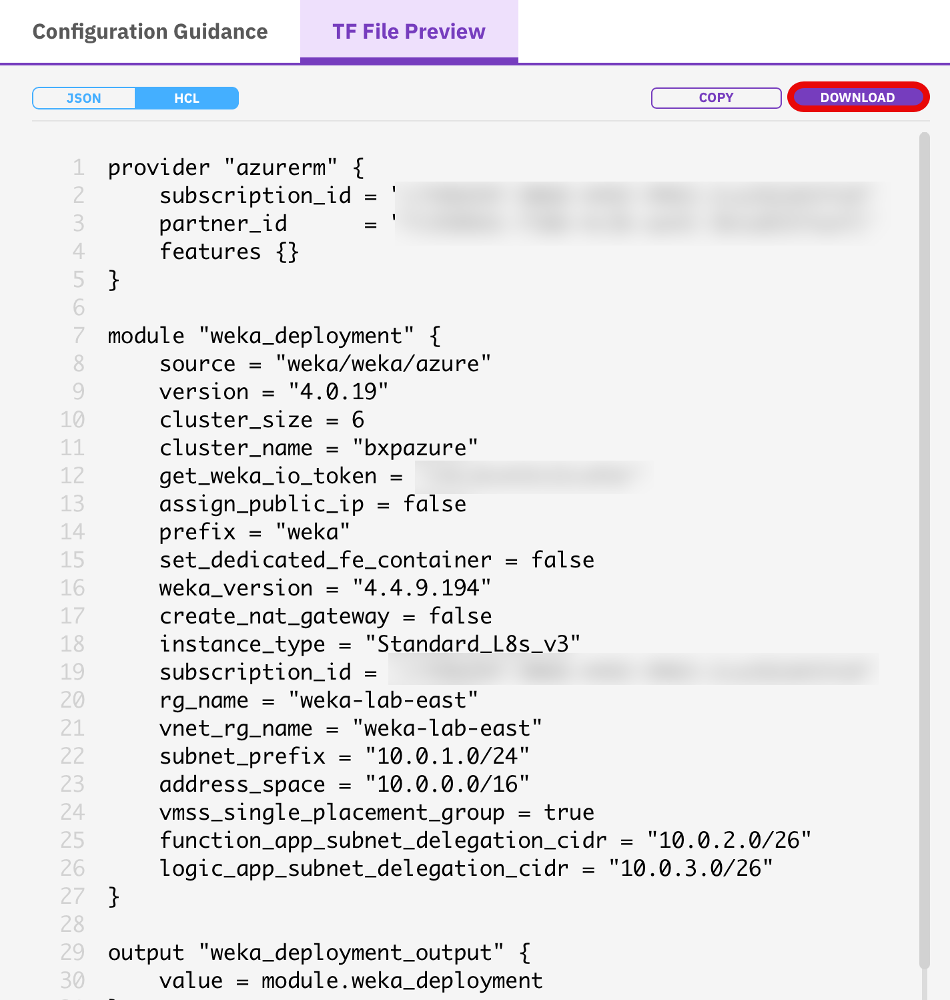

# Create Azure Cluster

## Overview
In this lab we will create a cluster in Azure and AWS, setup Snap 2 Object, then restore the file system to different cluster.

##  Creating WEKA cloud cluster
Creating the clusters will be done with WEKA CDM https://cloud.weka.io

To create a key pair search "key pairs" in the AWS 

1.  In WEKA CDM choose your cloud

    [](./images/cdm.png)

2.  Fill out the required fields on the Basic page that don't have defaults
    - Cluster Name
    - Subscription ID
    - Deployment Resource Group Nam
    - Vnet Resource Group Name

    [](./images/cdm_basic.png)

3.  On the Network Configuration page change "Create Vnet and Subnet" to **yes**

    [](./images/cdm_network.png)

4.  On the Security Configuration page change Create Network Security Group to **yes** 

    [](./images/cdm_security.png)

5.  On the Clients  page change "Number of Clients to **3**.  These clients will be used to generate test data that will be restored witn Snap2Obj.

    [](./images/cdm_clients.png)

6.  On the right hand side download the generated Terraform file

    [](./images/tf_download.png)

7.  Run **terrafrom init** and **terraform apply**.  You should get an output simialr to the below.


```
 "function_app_name" = "weka-bxpazure-function-app"
  "function_key_name" = "functionKeys"
  "functions_url" = {
    "progressing_status" = {
      "body" = {
        "type" = "progress"
      }
      "url" = "https://weka-bxpazure-function-app.azurewebsites.net/api/status"
    }
    "resize" = {
      "body" = {
        "value" = 7
      }
      "uri" = "https://weka-bxpazure-function-app.azurewebsites.net/api/resize"
    }
    "status" = {
      "body" = {
        "type" = "status"
      }
      "url" = "https://weka-bxpazure-function-app.azurewebsites.net/api/status"
    }
  }
  "key_vault_name" = "weka-bxpazure"
  "nfs_vmss_name" = null
  "ppg_id" = "/subscriptions/removed/resourceGroups/weka-lab-east/providers/Microsoft.Compute/proximityPlacementGroups/weka-bxpazure-backend-ppg"
  "private_ssh_key" = "/tmp/weka-bxpazure-private-key.pem"
  "s3_protocol_gateway_ips" = null
  "sg_id" = "/subscriptions/removed/resourceGroups/weka-lab-east/providers/Microsoft.Network/networkSecurityGroups/weka-sg"
  "smb_protocol_gateway_ips" = null
  "subnet_name" = "weka-subnet-0"
  "vm_username" = "weka"
  "vmss_name" = "weka-bxpazure-vmss"
  "vnet_name" = "weka-vnet"
  "vnet_rg_name" = "weka-lab-east"
  "weka_cluster_admin_password_secret_name" = "weka-password"
  ```


8.  Once that finishes you will need to logon to the **Azure Portal** and go to the WEKA 

   

##  New section 