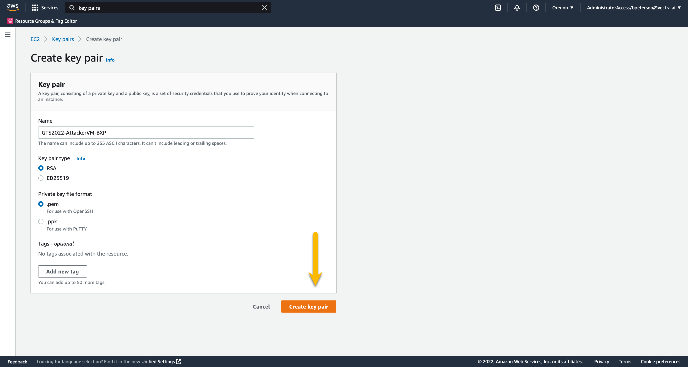
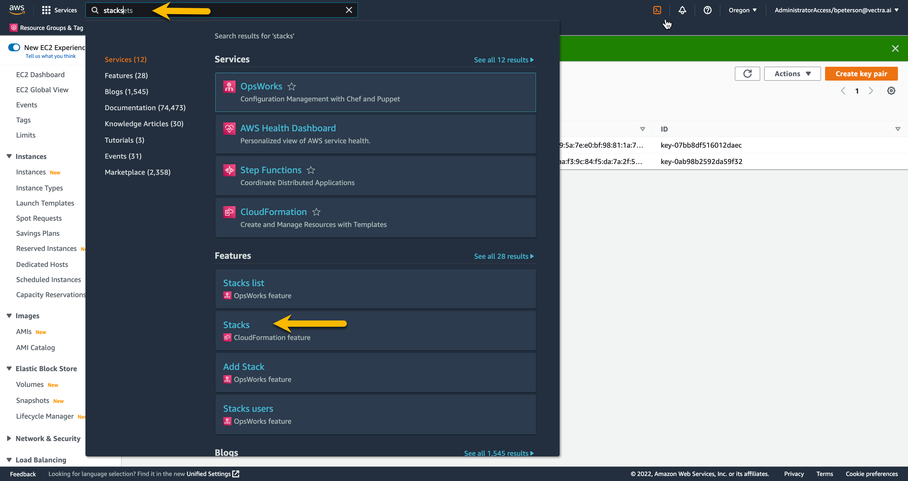
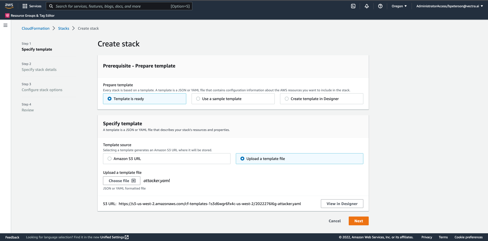
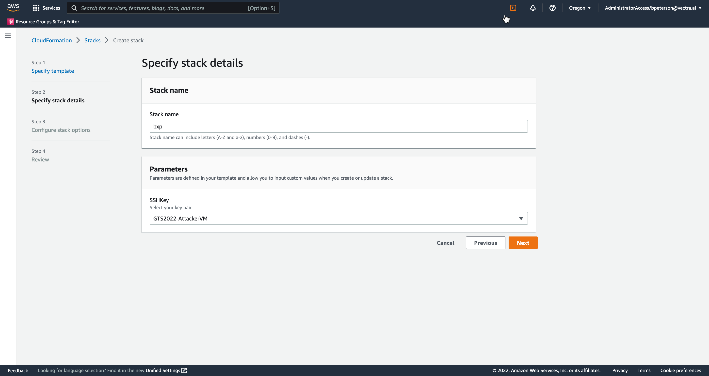

# Create Azure Cluster

## Overview
In this lab we will create a cluster in Azure and AWS, setup Snap 2 Object, then restore the file system to different cluster.

##  Creating WEKA cloud cluster
Creating the clusters will be done with WEKA CDM https://cloud.weka.io

To create a key pair search "key pairs" in the AWS 

1.  In WEKA CDM choose your cloud


    


2.  Fill out the required fields on the Basic page that don't have defaults
    - Cluster Name
    - Subscription ID
    - Deployment Resource Group Nam
    - Vnet Resource Group Name


    


3.  On the Network Configuration page change "Create Vnet and Subnet" to **yes**


    


4.  On the Security Configuration page change Create Network Security Group to **yes** 


    


5.  On the Clients  page change "Number of Clients to **3**.  These clients will be used to generate test data that will be restored witn Snap2Obj.


    


6.  On the right hand side download the generated Terraform file


    


7.  Run **terrafrom init** and **terraform apply**.  You should get an output simialr to the below.


```
 "function_app_name" = "weka-bxpazure-function-app"
  "function_key_name" = "functionKeys"
  "functions_url" = {
    "progressing_status" = {
      "body" = {
        "type" = "progress"
      }
      "url" = "https://weka-bxpazure-function-app.azurewebsites.net/api/status"
    }
    "resize" = {
      "body" = {
        "value" = 7
      }
      "uri" = "https://weka-bxpazure-function-app.azurewebsites.net/api/resize"
    }
    "status" = {
      "body" = {
        "type" = "status"
      }
      "url" = "https://weka-bxpazure-function-app.azurewebsites.net/api/status"
    }
  }
  "key_vault_name" = "weka-bxpazure"
  "nfs_vmss_name" = null
  "ppg_id" = "/subscriptions/removed/resourceGroups/weka-lab-east/providers/Microsoft.Compute/proximityPlacementGroups/weka-bxpazure-backend-ppg"
  "private_ssh_key" = "/tmp/weka-bxpazure-private-key.pem"
  "s3_protocol_gateway_ips" = null
  "sg_id" = "/subscriptions/removed/resourceGroups/weka-lab-east/providers/Microsoft.Network/networkSecurityGroups/weka-sg"
  "smb_protocol_gateway_ips" = null
  "subnet_name" = "weka-subnet-0"
  "vm_username" = "weka"
  "vmss_name" = "weka-bxpazure-vmss"
  "vnet_name" = "weka-vnet"
  "vnet_rg_name" = "weka-lab-east"
  "weka_cluster_admin_password_secret_name" = "weka-password"
  ```


8.  Once that finishes you will need to logon to the **Azure Portal** and go to the WEKA 


     

##  Creating Attacker VM from CloudFormation Template
Now that we have a key pair we are ready to start the CFT stack.

1.  First download the CFT [here](remove.yaml)

2.  In the AWS Management Console navigate to the **CFT Stacks** page by typing **stacks** in the search field and choose the stacks CloudFormation feature


    

3.  On the Stacks page press **Create stack** on the top right.  In the drop down choose **with new resources (standard)**

4.  On the Create stack page under Prepare template select **Template is ready** (default).  Under template source choose **Upload a template file**.  Choose your template file you previously downloaded.


    

5.  Press **Next** and enter a stack name of your **INITIALS**.  The CFT will automatically name your EC2 instance the name of your stack

6.  Under Parameters find your SSH key **GTS2022-AttackerVM-INITIALS** in the drop down and press **Next**


    

7.  On the Configure stack options page leave everything their default values and press **Next**

8.  On the Review page scroll to the bottom and press **Create stack**

9.  Once the stack complete press the **Outputs** tab and take note of the IP address


    

